# Backup System Security Architecture

## Complete Backup Security Flow

```mermaid
flowchart TB
    Start([Developer Initiates Migration]) --> Check{Backup First?}
    
    Check -->|Manual| Manual[pnpm db:backup]
    Check -->|Auto| Auto[pnpm db:migrate:safe]
    
    Manual --> CreateBackup
    Auto --> CreateBackup[Create Backup]
    
    CreateBackup --> GatherInfo[Gather DB Info]
    GatherInfo --> RunDump[pg_dump]
    RunDump --> CalcChecksum[Calculate SHA-256]
    CalcChecksum --> SaveMeta[Save Metadata JSON]
    SaveMeta --> VerifyBackup{Backup OK?}
    
    VerifyBackup -->|No| BackupFail[❌ Abort Migration]
    VerifyBackup -->|Yes| ApplyMigration[Apply Migration]
    
    ApplyMigration --> MigrationResult{Migration OK?}
    
    MigrationResult -->|Yes| Success[✅ Success]
    MigrationResult -->|No| Restore[Restore from Backup]
    
    Restore --> RestoreFlow
    Success --> End([Complete])
    BackupFail --> End
    
    RestoreFlow --> VerifyChecksum{Checksum Valid?}
    VerifyChecksum -->|No| Error[❌ Backup Corrupted]
    VerifyChecksum -->|Yes| Confirm{User Confirms?}
    Confirm -->|No| Cancel[❌ Cancelled]
    Confirm -->|Yes| RestoreDB[Restore Database]
    RestoreDB --> End
    
    style CreateBackup fill:#4299E1,color:#fff
    style CalcChecksum fill:#805AD5,color:#fff
    style VerifyChecksum fill:#48BB78,color:#fff
    style Error fill:#E53E3E,color:#fff
    style Success fill:#48BB78,color:#fff
```

## Security Layers Architecture

## Backup File Structure

## Backup & Restore Timeline

## Backup Storage Strategy

## Checksum Verification Flow

```mermaid
sequenceDiagram
    participant User
    participant BackupTool
    participant FileSystem
    participant Crypto
    participant Database
    
    Note over User,Database: Backup Creation
    User->>BackupTool: pnpm db:backup
    BackupTool->>Database: pg_dump
    Database-->>FileSystem: backup.sql
    FileSystem-->>BackupTool: File data
    BackupTool->>Crypto: Calculate SHA-256
    Crypto-->>BackupTool: Checksum hash
    BackupTool->>FileSystem: Save metadata.json
    BackupTool-->>User: ✅ Backup complete
    
    Note over User,Database: Restore Verification
    User->>BackupTool: pnpm db:restore
    BackupTool->>FileSystem: Read backup.sql
    BackupTool->>FileSystem: Read metadata.json
    BackupTool->>Crypto: Calculate SHA-256
    Crypto-->>BackupTool: Current hash
    BackupTool->>BackupTool: Compare checksums
    
    alt Checksums Match
        BackupTool-->>User: ✅ Valid backup
        User->>BackupTool: Confirm restore
        BackupTool->>Database: Apply backup
    else Checksums Don't Match
        BackupTool-->>User: ❌ Corrupted backup
    end
```

## Migration Safety Net

```mermaid
graph TB
    Start([Start Migration]) --> Phase1
    
    subgraph "Phase 1: Backup"
        Phase1[Create Backup]
        Phase1 --> Check1{Backup Success?}
        Check1 -->|No| Abort1[❌ Abort]
        Check1 -->|Yes| Phase2
    end
    
    subgraph "Phase 2: Migration"
        Phase2[Apply Migration]
        Phase2 --> Check2{Migration Success?}
        Check2 -->|No| Rollback1[Restore Backup]
        Check2 -->|Yes| Phase3
    end
    
    subgraph "Phase 3: Verification"
        Phase3[Run Tests]
        Phase3 --> Check3{Tests Pass?}
        Check3 -->|No| Rollback2[Restore Backup]
        Check3 -->|Yes| Phase4
    end
    
    subgraph "Phase 4: Finalization"
        Phase4[Create Post-Migration Backup]
        Phase4 --> Success[✅ Complete]
    end
    
    Abort1 --> End([End])
    Rollback1 --> End
    Rollback2 --> End
    Success --> End
    
    style Phase1 fill:#4299E1,color:#fff
    style Phase2 fill:#805AD5,color:#fff
    style Phase3 fill:#48BB78,color:#fff
    style Phase4 fill:#38B2AC,color:#fff
    style Abort1 fill:#E53E3E,color:#fff
    style Rollback1 fill:#ED8936,color:#fff
    style Rollback2 fill:#ED8936,color:#fff
```

## Disaster Recovery Hierarchy

```mermaid
graph TB
    Disaster[🔥 Disaster Scenario] --> Try1
    
    Try1{Latest Local<br/>Backup?} -->|Available| Local[Restore from Local]
    Try1 -->|Not Available| Try2
    
    Try2{Remote Cloud<br/>Backup?} -->|Available| Cloud[Restore from Cloud]
    Try2 -->|Not Available| Try3
    
    Try3{DR Site<br/>Backup?} -->|Available| DR[Restore from DR]
    Try3 -->|Not Available| Try4
    
    Try4{Point-in-Time<br/>Recovery?} -->|Available| PITR[WAL Recovery]
    Try4 -->|Not Available| Last
    
    Last[Manual Rebuild<br/>from Scratch] --> Document[Document Lessons]
    
    Local --> Verify
    Cloud --> Verify
    DR --> Verify
    PITR --> Verify
    
    Verify{Data Valid?} -->|Yes| Success[✅ Recovered]
    Verify -->|No| NextOption[Try Next Option]
    
    NextOption --> Try2
    
    style Disaster fill:#E53E3E,color:#fff
    style Success fill:#48BB78,color:#fff
    style Local fill:#4299E1,color:#fff
    style Cloud fill:#805AD5,color:#fff
```

---

**Visual Reference for:** [BACKUP_SECURITY_SUMMARY.md](../BACKUP_SECURITY_SUMMARY.md)
