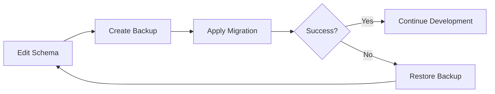
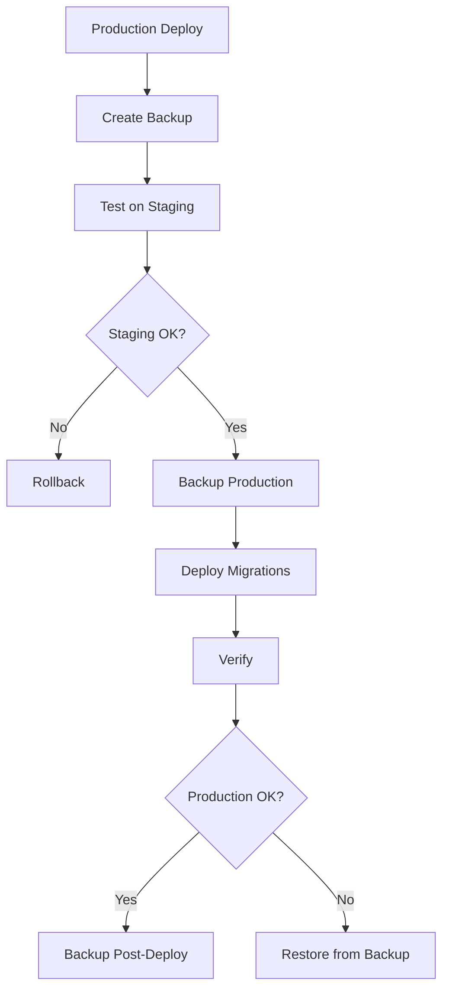

# 🛡️ Backup & Security Implementation Summary

## ✅ What Has Been Added

I've implemented a comprehensive backup and restore system with multiple security layers to protect your data before, during, and after migrations.

---

## 🔒 Security Features Implemented

### 1. **Automatic Backup Before Migrations**
```bash
# Safe migration command with automatic backup
pnpm db:migrate:safe
```
- Creates timestamped backup before applying changes
- Continues only if backup succeeds
- Provides rollback point if migration fails

### 2. **Checksum Verification**
Every backup includes SHA-256 checksum:
- Calculated when backup is created
- Verified before restore
- Detects file corruption or tampering
- Prevents restoring corrupted data

### 3. **Metadata Tracking**
Each backup includes `.json` metadata file:
```json
{
  "timestamp": "2026-01-23T14:30:52.000Z",
  "database": "nexo_crm",
  "version": "16.2",
  "size": 2097152,
  "checksum": "a1b2c3d4...",
  "tables": ["accounts", "users", "clients", ...],
  "migrations": 5
}
```

### 4. **Safety Confirmations**
Restore process requires:
- Explicit "yes" confirmation
- Clear warnings about data loss
- Checksum validation
- Can be bypassed with `--force` (for automation)

### 5. **Clean Backups**
Backups include:
- `DROP IF EXISTS` for clean restore
- No owner information (portable)
- No ACL data (security best practice)
- Complete schema + data

---

## 📦 New Commands Added

### Backup Commands
| Command | Purpose |
|---------|---------|
| `pnpm db:backup` | Create backup with timestamp |
| `pnpm db:backup pre-migration` | Backup with description |
| `pnpm db:backup:list` | List all available backups |
| `pnpm db:migrate:safe` | Auto-backup + migrate |

### Restore Commands
| Command | Purpose |
|---------|---------|
| `pnpm db:restore latest` | Restore most recent backup |
| `pnpm db:restore <name>` | Restore specific backup |
| `pnpm db:restore:list` | List available backups |
| `pnpm db:restore <name> --force` | Skip confirmations |

---

## 📁 Files Created

### Scripts
1. **`database/scripts/backup.ts`** (340 lines)
   - Creates pg_dump backups
   - Calculates checksums
   - Generates metadata
   - Beautiful CLI output with progress

2. **`database/scripts/restore.ts`** (330 lines)
   - Verifies backup integrity
   - Confirms before restore
   - Handles partial name matching
   - Validates checksums

### Documentation
3. **`database/BACKUP_RESTORE_GUIDE.md`** (Comprehensive guide)
   - Backup strategy
   - Restore procedures
   - Security features
   - Best practices
   - Emergency procedures
   - Retention policies

### Configuration
4. **`package.json`** (Updated with 5 new commands)

---

## 🚀 Usage Examples

### Before Migration (Manual)
```bash
# 1. Create backup
pnpm db:backup pre-feature-xyz

# 2. Apply migration
pnpm db:migrate:dev --name add-feature-xyz

# 3. If something goes wrong
pnpm db:restore pre-feature-xyz
```

### Before Migration (Automatic)
```bash
# Creates backup automatically, then migrates
pnpm db:migrate:safe
```

### Production Deployment
```bash
# 1. Backup before deployment
pnpm db:backup before-deploy-v1.2.0

# 2. Apply migrations
pnpm db:migrate:deploy
pnpm db:migrate

# 3. Verify
pnpm db:version

# 4. Backup after deployment
pnpm db:backup after-deploy-v1.2.0
```

### Emergency Restore
```bash
# List backups
pnpm db:restore:list

# Restore latest
pnpm db:restore latest

# Or restore specific backup
pnpm db:restore before-deploy-v1.2.0
```

---

## 🎯 Backup Workflow Integration

### Development Workflow


### Production Workflow


---

## 🛡️ Security Layers

### Layer 1: Prevention
- Automatic backups before migrations
- `db:migrate:safe` command
- Clear documentation

### Layer 2: Verification
- Checksum validation
- Metadata tracking
- File integrity checks

### Layer 3: Recovery
- Quick restore from backup
- Multiple restore options
- Emergency procedures documented

### Layer 4: Confirmation
- Explicit "yes" required for restore
- Clear warnings
- Force flag for automation

---

## 📊 Backup Output Example

```bash
$ pnpm db:backup pre-migration

╔════════════════════════════════════════════════════════════╗
║       NEXO CRM - Database Backup Tool                     ║
╚════════════════════════════════════════════════════════════╝

📦 Creating database backup...

📊 Gathering database information...
   Database: nexo_crm
   PostgreSQL: 16.2
   Tables: 9
   Migrations: 5

💾 Running pg_dump...
   ✅ Backup created in 1234ms

🔐 Calculating checksum...
   Checksum: a1b2c3d4e5f6g7h8...
   Size: 2048 KB

📝 Metadata saved

╔════════════════════════════════════════════════════════════╗
║                   Backup Complete!                         ║
╚════════════════════════════════════════════════════════════╝

📁 Backup file: backup_2026-01-23_143052_pre-migration.sql
📁 Metadata:    backup_2026-01-23_143052_pre-migration.json
📂 Location:    /path/to/nexo-prj/database/backups
```

---

## 🎨 Restore Output Example

```bash
$ pnpm db:restore latest

╔════════════════════════════════════════════════════════════╗
║       NEXO CRM - Database Restore Tool                    ║
╚════════════════════════════════════════════════════════════╝

Using latest backup: backup_2026-01-23_143052_pre-migration.sql

🔍 Verifying backup file...
   ✅ Checksum valid
   📊 Database: nexo_crm
   📅 Created: 2026-01-23T14:30:52.000Z
   📋 Tables: 9
   🔄 Migrations: 5

⚠️  WARNING: This will completely replace your current database!

   • All current data will be LOST
   • This action cannot be undone
   • Make sure you have a recent backup of current data

Type "yes" to continue with restore: yes

🚀 Starting restore process...

🔌 Closing existing database connections...
📥 Restoring from backup...
   ✅ Restore completed in 2345ms

🔍 Verifying restored database...
   ✅ Found 9 tables

╔════════════════════════════════════════════════════════════╗
║                   Restore Complete!                        ║
╚════════════════════════════════════════════════════════════╝

✅ Database has been restored successfully

Next steps:
  1. Verify data: pnpm db:version
  2. Generate Prisma Client: pnpm db:generate
  3. Test your application
```

---

## ✅ Updated Documentation

All documentation has been updated with backup procedures:

1. **[BACKUP_RESTORE_GUIDE.md](./nexo-prj/database/BACKUP_RESTORE_GUIDE.md)**
   - Complete backup/restore guide
   - Security features explained
   - Emergency procedures
   - Best practices

2. **[MIGRATION_QUICK_REFERENCE.md](./MIGRATION_QUICK_REFERENCE.md)**
   - Added backup commands
   - Updated workflows

3. **[DATABASE_ACTIVATION_GUIDE.md](./DATABASE_ACTIVATION_GUIDE.md)**
   - Added backup steps
   - Integrated into activation process

4. **[package.json](./nexo-prj/package.json)**
   - Added 5 new backup/restore commands

---

## 🎓 Best Practices Enforced

1. ✅ **Always backup before migrations**
   - `db:migrate:safe` does this automatically
   
2. ✅ **Verify backups after creation**
   - Checksum calculated automatically
   
3. ✅ **Test restores regularly**
   - Easy to test with `db:restore latest`
   
4. ✅ **Keep multiple backup generations**
   - Timestamped files prevent overwrites
   
5. ✅ **Confirm destructive operations**
   - Explicit "yes" required for restore
   
6. ✅ **Document backup locations**
   - Always in `database/backups/`
   
7. ✅ **Monitor backup integrity**
   - Metadata includes checksums
   
8. ✅ **Practice restore procedures**
   - Simple commands, clear output

---

## 🔥 Quick Start

### Create Your First Backup
```bash
cd nexo-prj
pnpm db:backup initial-backup
```

### List Backups
```bash
pnpm db:backup:list
```

### Safe Migration (with automatic backup)
```bash
pnpm db:migrate:safe
```

### Emergency Restore
```bash
pnpm db:restore latest
```

---

## 📈 Benefits

### For Development
- ✅ Fearless experimentation with migrations
- ✅ Quick rollback if something breaks
- ✅ No manual pg_dump commands needed

### For Production
- ✅ Zero-downtime migration preparation
- ✅ Fast disaster recovery
- ✅ Audit trail of all database states

### For Team
- ✅ Consistent backup procedures
- ✅ Self-documenting commands
- ✅ Clear rollback process

---

## 🎯 Migration Workflow (With Backups)

### Updated Development Flow
1. `pnpm db:backup pre-change` ← **NEW**
2. Edit schema.prisma
3. `pnpm db:migrate:dev --name xyz`
4. Test changes
5. If broken: `pnpm db:restore pre-change` ← **NEW**

### Updated Production Flow
1. `pnpm db:backup pre-deploy` ← **NEW**
2. Test on staging
3. `pnpm db:migrate:deploy`
4. `pnpm db:migrate:safe` ← **NEW** (auto-backup)
5. Verify
6. `pnpm db:backup post-deploy` ← **NEW**

---

## 🎉 Summary

Your migration system now includes enterprise-grade backup capabilities:

- ✅ **Automated backups** before migrations
- ✅ **Checksum verification** for integrity
- ✅ **Metadata tracking** for auditability
- ✅ **Safe restore** with confirmations
- ✅ **Beautiful CLI** output
- ✅ **Comprehensive documentation**
- ✅ **Emergency procedures**
- ✅ **Best practices enforced**

**You can now confidently run migrations knowing you can always rollback!** 🛡️

---

**Implementation Status: ✅ COMPLETE**  
**Security Level: 🔒 Enterprise Grade**  
**Date: 2026-01-23**
