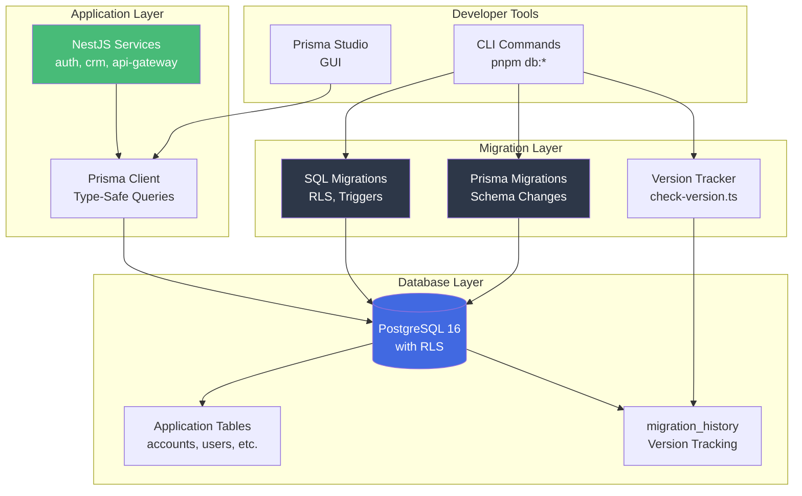
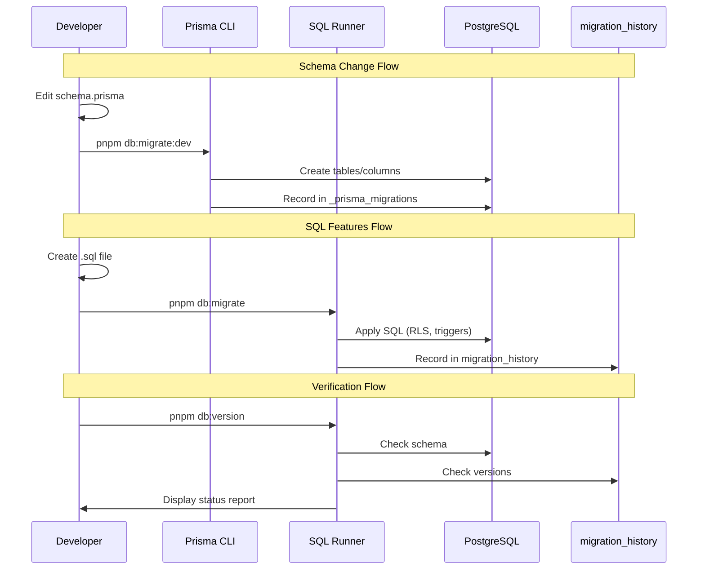
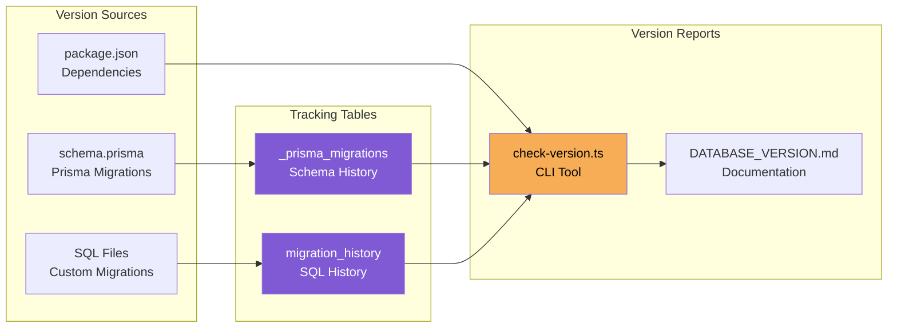
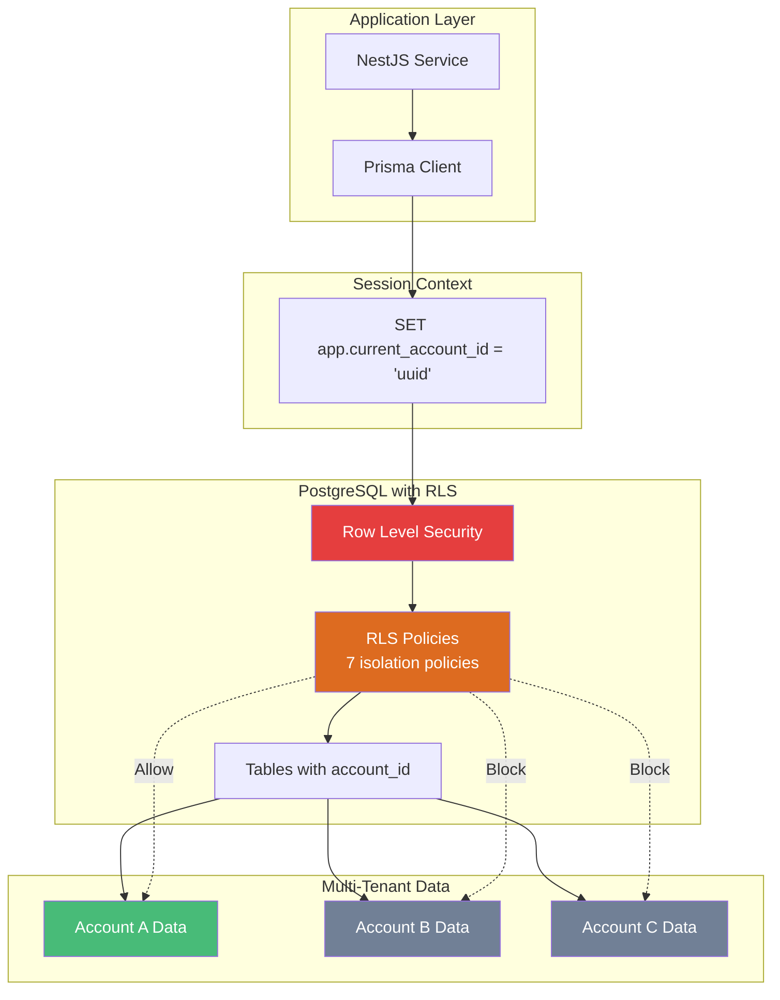
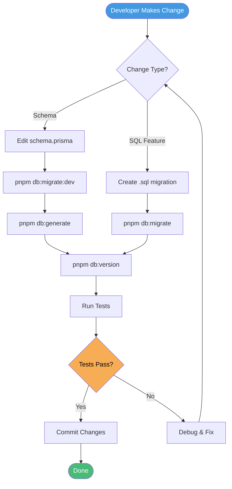
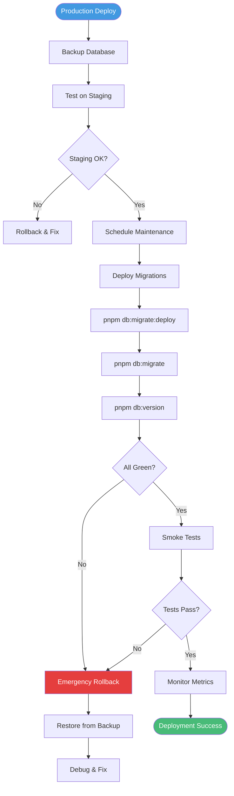
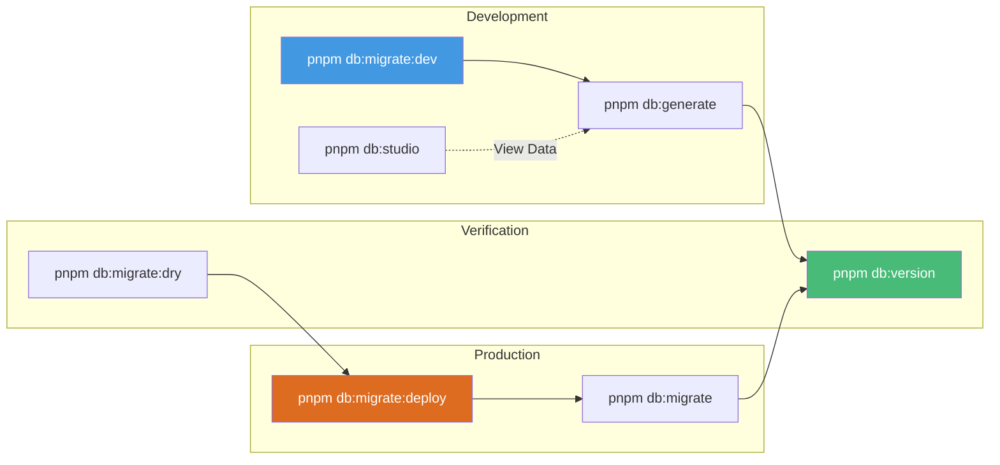

# Database Migration System Architecture

## System Overview



## Migration Flow



## Version Tracking System



## Multi-Tenant RLS Architecture



## Development Workflow



## Production Deployment Flow



## File Structure

```
nexo-prj/
├── prisma/
│   ├── schema.prisma          ← Define tables & relations
│   ├── prisma.config.ts       ← Prisma 7 configuration
│   └── migrations/
│       ├── 20260123_*_initial/
│       │   └── migration.sql   ← Auto-generated
│       └── migration_lock.toml
│
├── database/
│   ├── DATABASE_VERSION.md    ← Version documentation
│   ├── migrations/
│   │   ├── README.md          ← Strategy guide
│   │   └── sql/
│   │       └── 20260123_1800_*.sql  ← Custom SQL
│   └── scripts/
│       ├── check-version.ts   ← Version checker
│       └── migrate.ts         ← SQL runner
│
└── .env                       ← Database connection
```

## Command Flow Diagram



---

**Visual Reference for:** [MIGRATION_SYSTEM_SUMMARY.md](./MIGRATION_SYSTEM_SUMMARY.md)
