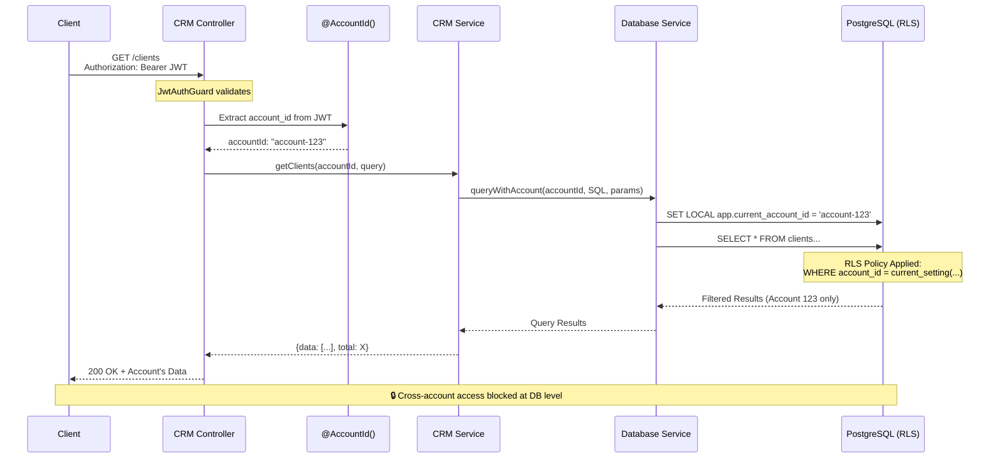

```mermaid
sequenceDiagram
    participant Client
    participant Controller as CRM Controller
    participant Decorator as @AccountId()
    participant Service as CRM Service
    participant DB as Database Service
    participant PG as PostgreSQL (RLS)

    Client->>Controller: GET /clients<br/>Authorization: Bearer JWT
    Note over Controller: JwtAuthGuard validates
    Controller->>Decorator: Extract account_id from JWT
    Decorator-->>Controller: accountId: "account-123"
    Controller->>Service: getClients(accountId, query)
    Service->>DB: queryWithAccount(accountId, SQL, params)
    DB->>PG: SET LOCAL app.current_account_id = 'account-123'
    DB->>PG: SELECT * FROM clients...
    Note over PG: RLS Policy Applied:<br/>WHERE account_id = current_setting(...)
    PG-->>DB: Filtered Results (Account 123 only)
    DB-->>Service: Query Results
    Service-->>Controller: {data: [...], total: X}
    Controller-->>Client: 200 OK + Account's Data
    
    Note over Client,PG: 🔒 Cross-account access blocked at DB level
```
