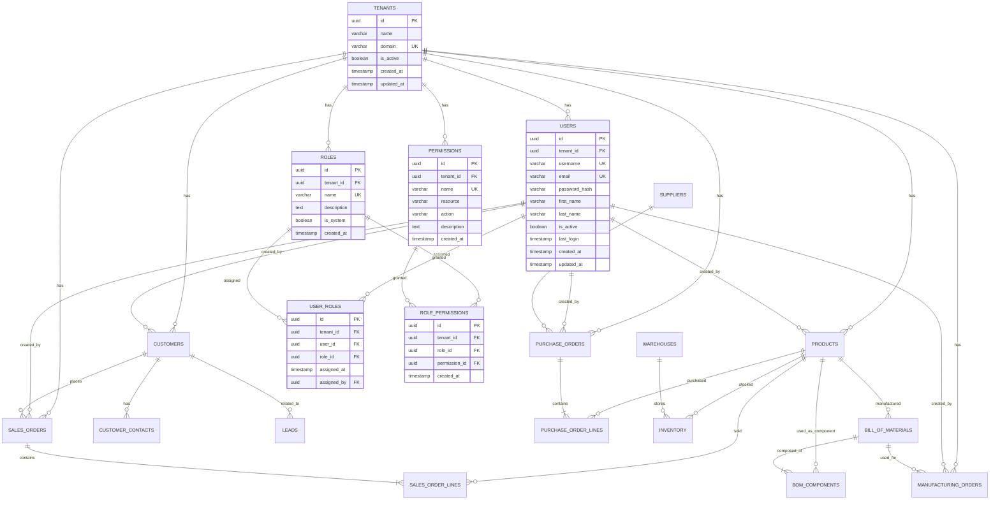

```mermaid
erDiagram
    direction TB

    TENANTS ||--o{ USERS : "has"
    TENANTS ||--o{ ROLES : "has"
    TENANTS ||--o{ PERMISSIONS : "has"
    TENANTS ||--o{ CUSTOMERS : "has"
    TENANTS ||--o{ PRODUCTS : "has"
    TENANTS ||--o{ SALES_ORDERS : "has"
    TENANTS ||--o{ PURCHASE_ORDERS : "has"
    TENANTS ||--o{ MANUFACTURING_ORDERS : "has"

    USERS ||--o{ USER_ROLES : "assigned"
    ROLES ||--o{ USER_ROLES : "assigned"
    ROLES ||--o{ ROLE_PERMISSIONS : "granted"
    PERMISSIONS ||--o{ ROLE_PERMISSIONS : "granted"

    USERS ||--o{ SALES_ORDERS : "created_by"
    USERS ||--o{ PURCHASE_ORDERS : "created_by"
    USERS ||--o{ MANUFACTURING_ORDERS : "created_by"
    USERS ||--o{ CUSTOMERS : "created_by"
    USERS ||--o{ PRODUCTS : "created_by"

    CUSTOMERS ||--o{ SALES_ORDERS : "places"
    CUSTOMERS ||--o{ CUSTOMER_CONTACTS : "has"
    CUSTOMERS ||--o{ LEADS : "related_to"

    PRODUCTS ||--o{ SALES_ORDER_LINES : "sold"
    PRODUCTS ||--o{ PURCHASE_ORDER_LINES : "purchased"
    PRODUCTS ||--o{ INVENTORY : "stocked"
    PRODUCTS ||--o{ BOM_COMPONENTS : "used_as_component"
    PRODUCTS ||--o{ BILL_OF_MATERIALS : "manufactured"

    SALES_ORDERS ||--|{ SALES_ORDER_LINES : "contains"
    PURCHASE_ORDERS ||--|{ PURCHASE_ORDER_LINES : "contains"

    SUPPLIERS ||--o{ PURCHASE_ORDERS : "supplies"

    WAREHOUSES ||--o{ INVENTORY : "stores"

    BILL_OF_MATERIALS ||--|{ BOM_COMPONENTS : "composed_of"
    BILL_OF_MATERIALS ||--o{ MANUFACTURING_ORDERS : "used_for"

    TENANTS {
        uuid id PK
        varchar name
        varchar domain UK
        boolean is_active
        timestamp created_at
        timestamp updated_at
    }

    USERS {
        uuid id PK
        uuid tenant_id FK
        varchar username UK
        varchar email UK
        varchar password_hash
        varchar first_name
        varchar last_name
        boolean is_active
        timestamp last_login
        timestamp created_at
        timestamp updated_at
    }

    ROLES {
        uuid id PK
        uuid tenant_id FK
        varchar name UK
        text description
        boolean is_system
        timestamp created_at
    }

    PERMISSIONS {
        uuid id PK
        uuid tenant_id FK
        varchar name UK
        varchar resource
        varchar action
        text description
        timestamp created_at
    }

    USER_ROLES {
        uuid id PK
        uuid tenant_id FK
        uuid user_id FK
        uuid role_id FK
        timestamp assigned_at
        uuid assigned_by FK
    }

    ROLE_PERMISSIONS {
        uuid id PK
        uuid tenant_id FK
        uuid role_id FK
        uuid permission_id FK
        timestamp created_at
    }
```