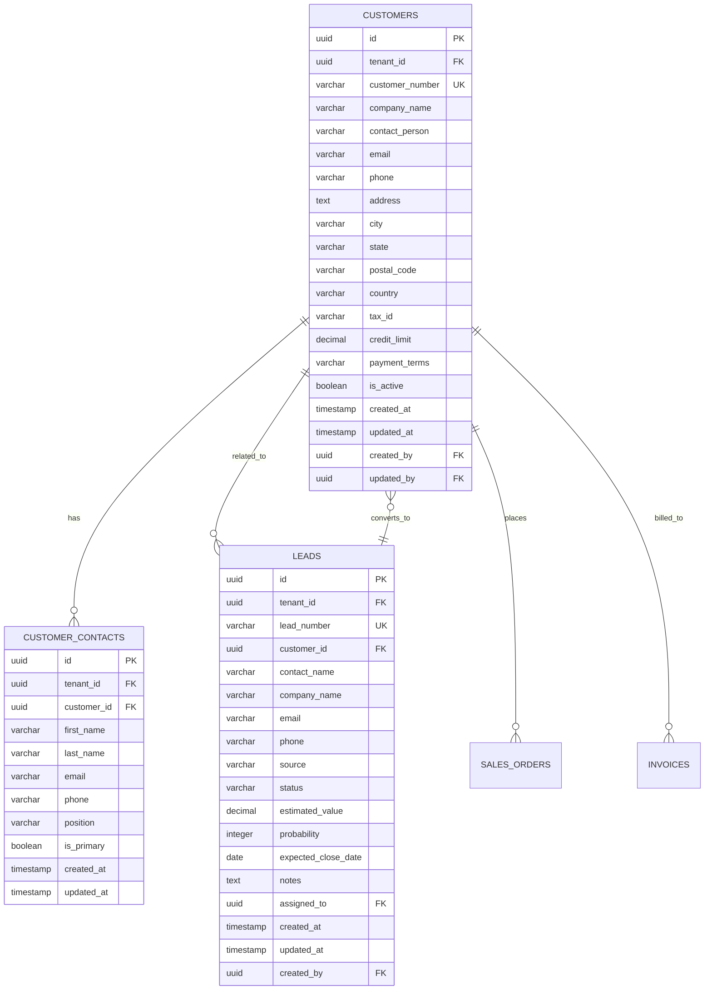

```mermaid
erDiagram
    direction TB

    CUSTOMERS ||--o{ CUSTOMER_CONTACTS : "has"
    CUSTOMERS ||--o{ LEADS : "related_to"
    CUSTOMERS ||--o{ SALES_ORDERS : "places"
    CUSTOMERS ||--o{ INVOICES : "billed_to"

    LEADS ||--o{ CUSTOMERS : "converts_to"

    CUSTOMERS {
        uuid id PK
        uuid tenant_id FK
        varchar customer_number UK
        varchar company_name
        varchar contact_person
        varchar email
        varchar phone
        text address
        varchar city
        varchar state
        varchar postal_code
        varchar country
        varchar tax_id
        decimal credit_limit
        varchar payment_terms
        boolean is_active
        timestamp created_at
        timestamp updated_at
        uuid created_by FK
        uuid updated_by FK
    }

    CUSTOMER_CONTACTS {
        uuid id PK
        uuid tenant_id FK
        uuid customer_id FK
        varchar first_name
        varchar last_name
        varchar email
        varchar phone
        varchar position
        boolean is_primary
        timestamp created_at
        timestamp updated_at
    }

    LEADS {
        uuid id PK
        uuid tenant_id FK
        varchar lead_number UK
        uuid customer_id FK
        varchar contact_name
        varchar company_name
        varchar email
        varchar phone
        varchar source
        varchar status
        decimal estimated_value
        integer probability
        date expected_close_date
        text notes
        uuid assigned_to FK
        timestamp created_at
        timestamp updated_at
        uuid created_by FK
    }
```