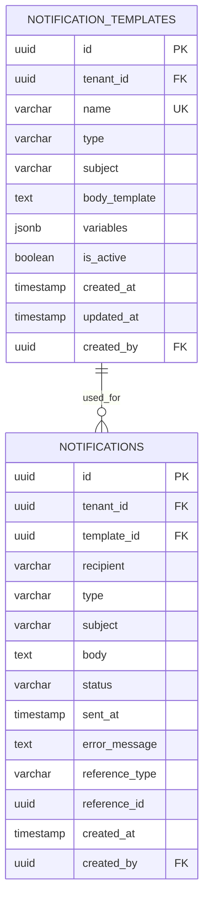

```mermaid
erDiagram
    direction TB

    NOTIFICATION_TEMPLATES ||--o{ NOTIFICATIONS : "used_for"

    NOTIFICATIONS {
        uuid id PK
        uuid tenant_id FK
        uuid template_id FK
        varchar recipient
        varchar type
        varchar subject
        text body
        varchar status
        timestamp sent_at
        text error_message
        varchar reference_type
        uuid reference_id
        timestamp created_at
        uuid created_by FK
    }

    NOTIFICATION_TEMPLATES {
        uuid id PK
        uuid tenant_id FK
        varchar name UK
        varchar type
        varchar subject
        text body_template
        jsonb variables
        boolean is_active
        timestamp created_at
        timestamp updated_at
        uuid created_by FK
    }
```