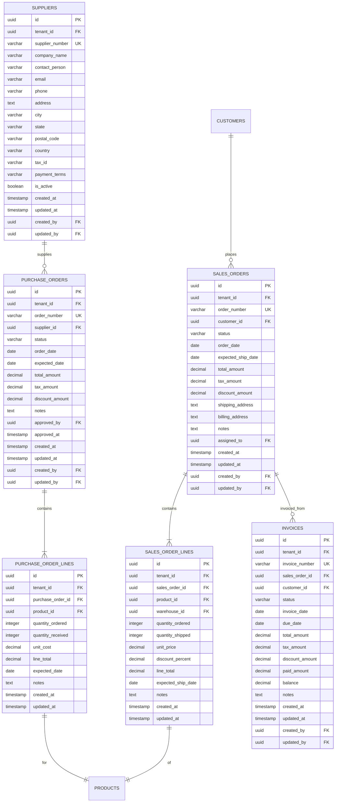

```mermaid
erDiagram
    direction TB

    SUPPLIERS ||--o{ PURCHASE_ORDERS : "supplies"

    PURCHASE_ORDERS ||--|{ PURCHASE_ORDER_LINES : "contains"
    PURCHASE_ORDER_LINES ||--|| PRODUCTS : "for"

    CUSTOMERS ||--o{ SALES_ORDERS : "places"
    SALES_ORDERS ||--|{ SALES_ORDER_LINES : "contains"
    SALES_ORDER_LINES ||--|| PRODUCTS : "of"

    SALES_ORDERS ||--o{ INVOICES : "invoiced_from"

    SUPPLIERS {
        uuid id PK
        uuid tenant_id FK
        varchar supplier_number UK
        varchar company_name
        varchar contact_person
        varchar email
        varchar phone
        text address
        varchar city
        varchar state
        varchar postal_code
        varchar country
        varchar tax_id
        varchar payment_terms
        boolean is_active
        timestamp created_at
        timestamp updated_at
        uuid created_by FK
        uuid updated_by FK
    }

    PURCHASE_ORDERS {
        uuid id PK
        uuid tenant_id FK
        varchar order_number UK
        uuid supplier_id FK
        varchar status
        date order_date
        date expected_date
        decimal total_amount
        decimal tax_amount
        decimal discount_amount
        text notes
        uuid approved_by FK
        timestamp approved_at
        timestamp created_at
        timestamp updated_at
        uuid created_by FK
        uuid updated_by FK
    }

    PURCHASE_ORDER_LINES {
        uuid id PK
        uuid tenant_id FK
        uuid purchase_order_id FK
        uuid product_id FK
        integer quantity_ordered
        integer quantity_received
        decimal unit_cost
        decimal line_total
        date expected_date
        text notes
        timestamp created_at
        timestamp updated_at
    }

    SALES_ORDERS {
        uuid id PK
        uuid tenant_id FK
        varchar order_number UK
        uuid customer_id FK
        varchar status
        date order_date
        date expected_ship_date
        decimal total_amount
        decimal tax_amount
        decimal discount_amount
        text shipping_address
        text billing_address
        text notes
        uuid assigned_to FK
        timestamp created_at
        timestamp updated_at
        uuid created_by FK
        uuid updated_by FK
    }

    SALES_ORDER_LINES {
        uuid id PK
        uuid tenant_id FK
        uuid sales_order_id FK
        uuid product_id FK
        uuid warehouse_id FK
        integer quantity_ordered
        integer quantity_shipped
        decimal unit_price
        decimal discount_percent
        decimal line_total
        date expected_ship_date
        text notes
        timestamp created_at
        timestamp updated_at
    }

    INVOICES {
        uuid id PK
        uuid tenant_id FK
        varchar invoice_number UK
        uuid sales_order_id FK
        uuid customer_id FK
        varchar status
        date invoice_date
        date due_date
        decimal total_amount
        decimal tax_amount
        decimal discount_amount
        decimal paid_amount
        decimal balance
        text notes
        timestamp created_at
        timestamp updated_at
        uuid created_by FK
        uuid updated_by FK
    }
```