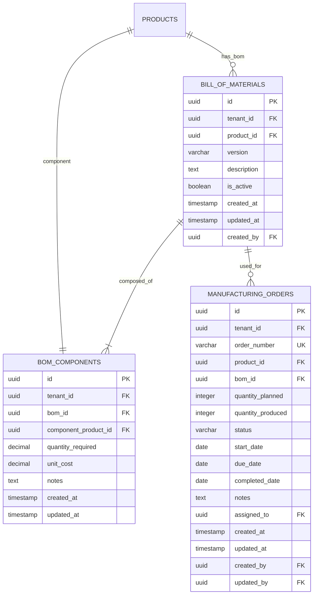

```mermaid
erDiagram
    direction TB

    PRODUCTS ||--o{ BILL_OF_MATERIALS : "has_bom"

    BILL_OF_MATERIALS ||--|{ BOM_COMPONENTS : "composed_of"
    BOM_COMPONENTS ||--|| PRODUCTS : "component"

    BILL_OF_MATERIALS ||--o{ MANUFACTURING_ORDERS : "used_for"

    BILL_OF_MATERIALS {
        uuid id PK
        uuid tenant_id FK
        uuid product_id FK
        varchar version
        text description
        boolean is_active
        timestamp created_at
        timestamp updated_at
        uuid created_by FK
    }

    BOM_COMPONENTS {
        uuid id PK
        uuid tenant_id FK
        uuid bom_id FK
        uuid component_product_id FK
        decimal quantity_required
        decimal unit_cost
        text notes
        timestamp created_at
        timestamp updated_at
    }

    MANUFACTURING_ORDERS {
        uuid id PK
        uuid tenant_id FK
        varchar order_number UK
        uuid product_id FK
        uuid bom_id FK
        integer quantity_planned
        integer quantity_produced
        varchar status
        date start_date
        date due_date
        date completed_date
        text notes
        uuid assigned_to FK
        timestamp created_at
        timestamp updated_at
        uuid created_by FK
        uuid updated_by FK
    }
```