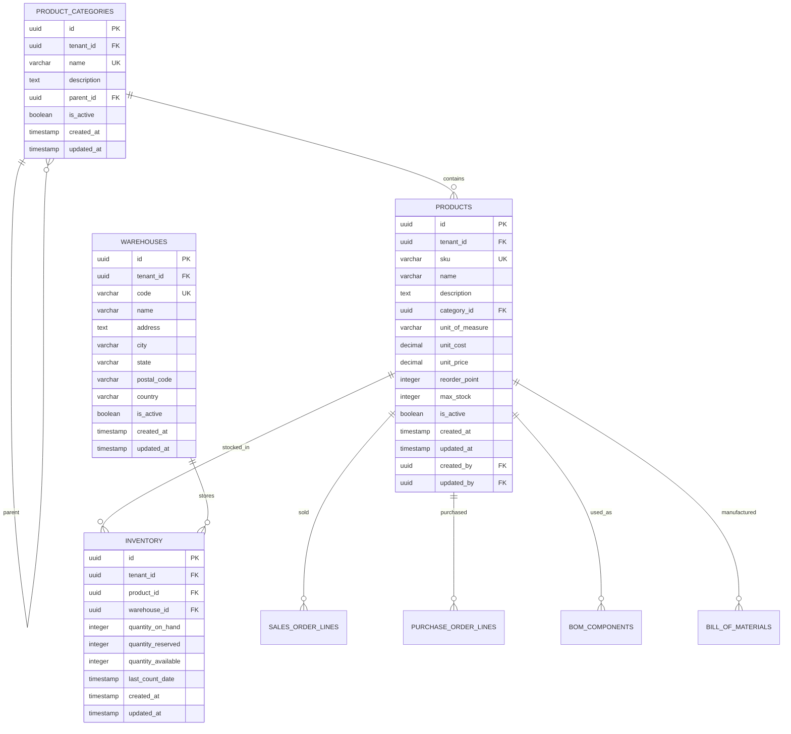

```mermaid
erDiagram
    direction TB

    PRODUCT_CATEGORIES ||--o{ PRODUCT_CATEGORIES : "parent"
    PRODUCT_CATEGORIES ||--o{ PRODUCTS : "contains"

    PRODUCTS ||--o{ INVENTORY : "stocked_in"
    PRODUCTS ||--o{ SALES_ORDER_LINES : "sold"
    PRODUCTS ||--o{ PURCHASE_ORDER_LINES : "purchased"
    PRODUCTS ||--o{ BOM_COMPONENTS : "used_as"
    PRODUCTS ||--o{ BILL_OF_MATERIALS : "manufactured"

    WAREHOUSES ||--o{ INVENTORY : "stores"

    PRODUCT_CATEGORIES {
        uuid id PK
        uuid tenant_id FK
        varchar name UK
        text description
        uuid parent_id FK
        boolean is_active
        timestamp created_at
        timestamp updated_at
    }

    PRODUCTS {
        uuid id PK
        uuid tenant_id FK
        varchar sku UK
        varchar name
        text description
        uuid category_id FK
        varchar unit_of_measure
        decimal unit_cost
        decimal unit_price
        integer reorder_point
        integer max_stock
        boolean is_active
        timestamp created_at
        timestamp updated_at
        uuid created_by FK
        uuid updated_by FK
    }

    WAREHOUSES {
        uuid id PK
        uuid tenant_id FK
        varchar code UK
        varchar name
        text address
        varchar city
        varchar state
        varchar postal_code
        varchar country
        boolean is_active
        timestamp created_at
        timestamp updated_at
    }

    INVENTORY {
        uuid id PK
        uuid tenant_id FK
        uuid product_id FK
        uuid warehouse_id FK
        integer quantity_on_hand
        integer quantity_reserved
        integer quantity_available
        timestamp last_count_date
        timestamp created_at
        timestamp updated_at
    }
```